# 🌌 KaleidoSphere

> **The Domain-Driven, Test-First Agent Operating System.**
> *Infinite Patterns from Simple Elements.*

KaleidoSphere（万花境） is a standardized architecture for building, testing, and running autonomous AI Agents.

### 🌌 Naming (The Name)
*   **Sphere**: A self-contained ecosystem for Agent collaboration and execution.
*   **Kaleidoscope**: The ability to combine atomic Skills and Roles into infinite adaptive Workflows.

### 🧠 Core Philosophy
*   **Prism**: We treat vague requirements as white light, refracting them through the KaleidoSphere into a clear spectrum of atomic tasks (`tasks.md`).
*   **Assetization**:
    *   **Process Asset**: Task breakdowns exist as files, enabling seamless handoffs between different models (e.g., Claude to Codex).
    *   **Knowledge Sedimentation**: The unique **Harvest** mechanism automatically distills key decisions from the transient "development process" into permanent "project wisdom" (`project_context.md`) upon completion.

## 🛡️ Key Features

> Empowering Agents with Engineering Soul.

### 1. Context Harvest
The systematic solution to LLM "forgetfulness". The system monitors session length and proactively **distills** key decisions into long-term memory while archiving redundant logs upon task completion.

### 2. Shadow Secretary
A automated recording system. Every feedback, correction, or comment you make is automatically captured and structured, eliminating manual note-taking.

### 3. Git Guardian
Enterprise-grade security aspect. Before any destructive file operation, the system enforces a Git status check. If uncommitted changes exist, it **refuses execution** to prevent data loss.

### 4. Identity Lock
Built-in injection defense. Strictly limits the Agent's role-play scope, preventing Prompt Injection attacks and ensuring data security.

### 5. Testing Framework
Domain-driven test suites keep Skills, Rules, and Workflows regression-safe.
👉 **[Testing Guide](docs/development/TESTING.md)**

### Architecture Overview
Note: Capabilities are global guardrails; Skills are execution entry points. Skills must follow capabilities; capabilities do not call skills.
Install and workflow decisions live in capabilities, while execution stays in skills. See the diagrams for details.

```mermaid
graph TD
    User((User)) --> Skills[🧠 Skills]
    Skills --> Rules[🛡️ Rules]
    Skills --> Caps[⚡ Capabilities]
    Skills --> Docs[📄 Artifacts]
```

👉 **[Full Architecture](docs/design/architecture.md)**

[中文文档](README_CN.md)

## 🚀 Quick Start

1.  **Embedded Installation**:
    ```bash
    git clone https://github.com/cydynamic/KaleidoSphere.git .kaleidosphere
    echo ".kaleidosphere/" >> .gitignore
    ```

2.  **Activate**:
    > "Please read `.kaleidosphere/docs/install.md` and activate KaleidoSphere."

---

## 🎮 User Manual
👉 **[Cookbook (COOKBOOK_CN.md)](COOKBOOK_CN.md)**

---

## 🛠 Development & Contribution
For KaleidoSphere self-development, see:
- `meta-studio/README.md`
- `CONTRIBUTING.md`

---

## 🙏 Acknowledgements

Inspired by:
*   **[OpenSpec](https://github.com/Fission-AI/OpenSpec)**
*   **[Superpowers](https://github.com/obra/superpowers)**

---
*Maintained by Cayce*
