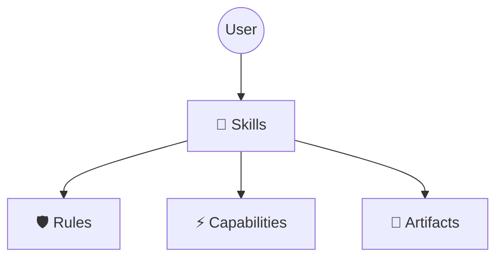

# 🌌 万花境

> **面向工程的 AI 协作系统。**
> *Infinite Patterns from Simple Elements.*

万花境（KaleidoSphere）是一套标准化的 Agent 协作与执行架构，用于构建、测试与运行自治式 AI 工作流。

### 🌌 命名寓意 (The Name)
*   **Sphere (领域)**: 一个自包含的 Agent 协作与执行生态系统。
*   **Kaleidoscope (万花筒)**: 通过组合原子化的 Skills 与 Roles，折射出无限适应性的 Workflows。

### 🧠 核心哲学 (Core Philosophy)
*   **棱镜 (Prism)**: 将模糊需求折射为清晰、原子化的任务光谱 (`tasks.md`)。
*   **资产化 (Assetization)**:
    *   **过程资产**: 任务拆解以文件存在，支持跨模型接力。
*   **知识沉淀**: 通过 **Harvest（沉淀）** 机制把“过程”提炼为“长期知识” (`project_context.md`)。

## 🛡️ 核心特性 (Key Features)

> 让 Agent 从“代码生成器”进化为“资深工程师”。

### 1. 上下文沉淀 (Context Harvest)
系统在任务完成时**主动提炼**关键决策到长期记忆，并归档冗余日志。

### 2. 影子秘书 (Shadow Secretary)
自动化记录系统。你的反馈与修正会被结构化归档，减少手工整理。

### 3. Git 守护者 (Git Guardian)
执行修改前强制检查 Git 状态，避免未提交变更被覆盖。

### 4. 身份锁定 (Identity Lock)
内置防注入机制，限制角色越界，保护安全边界。

### 5. 测试体系 (Testing Framework)
基于 Domain-Driven Testing 的测试套件，覆盖 Skills / Rules / Workflow，保证改动可回归。
👉 **[测试指南 (TESTING.md)](docs/development/TESTING.md)**

### 架构概览 (Architecture)
说明：能力是全局护栏/规则层，技能是执行入口；技能执行时必须遵循能力，能力不调用技能。
安装与流程由能力决策、技能执行，细节见架构图与流程图。

👉 **[查看完整架构设计](docs/design/architecture_cn.md)**

[English](README.md)

## 🚀 快速启动

1.  **嵌入式安装** (推荐):
    ```bash
    git clone https://github.com/cydynamic/KaleidoSphere.git .kaleidosphere
    echo ".kaleidosphere/" >> .gitignore
    ```

2.  **激活系统**:
    > "请读取 `.kaleidosphere/docs/install.md` 并激活万花境。"

---

## 🎮 用户必读
👉 **[实战指南 (COOKBOOK_CN.md)](COOKBOOK_CN.md)**

---

## 🛠 开发与贡献
开发万花境自身请参考：
- `meta-studio/README.md`
- `CONTRIBUTING.md`

---

## 🙏 致敬 (Acknowledgements)

万花境 的设计深受以下先行项目的启发：

*   **[OpenSpec](https://github.com/Fission-AI/OpenSpec)**
*   **[Superpowers](https://github.com/obra/superpowers)**

---
*Maintained by Cayce*
