# 🏛️ Architecture & Design

## System Architecture

KaleidoSphere uses a layered architecture to ensure stability and scalability.
Capabilities are global guardrails; Skills are execution entry points. Skills must follow capabilities; capabilities do not call skills.

```mermaid
graph TD
    User((User 👤))
    
    subgraph KaleidoSphere [KaleidoSphere OS]
        subgraph Kernel [Kernel Layer]
            Protocol[Rules / Protocol 📜]
            Identity[Identity Lock 🔐]
        end
        
        subgraph Cortex [Cognitive Layer]
            Setup[Setup Skill 🏗️]
            Install[Install Skill 🧰]
            Planning[Planning Skill 🧠]
            Workflow[Workflow Skill 🧭]
            Analysis[Analysis Skill 🔍]
            Coding[Coding Skill ⚡]
            Collaboration[Collaboration Skill 🤝]
        end
        
        subgraph Superpowers [Capability Layer]
            Git[Git Guardian 🛡️]
            Sec[Secretary 📝]
            Mem[Memory System 💾]
            Prog[Progress Manager 📈]
            InstallStrat[Install Strategy 🧩]
            FlowStrat[Workflow Strategy 🧭]
            Arch[Archivist 📦]
        end
        
        subgraph Artifacts [Asset Layer]
            PRD[PRD Docs 📄]
            Code[Source Code 💻]
            Progress[Progress Log 📊]
        end

        subgraph SelfDevKit ["Self-Dev Kit (meta-studio/self-dev)"]
            DevDocs["self-dev/docs (maintenance docs)"]
            DevTests["self-dev/tests (suites)"]
            DevRunner["run_tests.sh"]
        end
    end

    User -->|Natural Language| Cortex
    Cortex -->|Consult| Kernel
    Cortex -->|Invoke| Superpowers
    Cortex -->|Generate| Artifacts
    Cortex -->|Maintain| SelfDevKit
    Superpowers -->|Persist| Artifacts
    Superpowers -->|Protect| Code
```



## User Project Workflow

This flow targets user projects (embedded `.kaleidosphere`). KaleidoSphere implements an "Active -> Harvest -> Shared" lifecycle, separating **L1 (Global)** and **L2 (Session)** context.
Workflow decisions are handled by the Workflow Strategy capability, and execution is driven by the Workflow Skill.

```mermaid
graph TD
    User((User))
    Flow[Workflow Strategy Capability]
    InstallStrat[Install Strategy Capability]
    
    subgraph Shared [Shared Layer (L1)]
        Progress[progress.md (Global Status)]
        Memory[project_context.md (Long-term)]
    end
    
    subgraph Active [Active Layer (L2)]
        Job[Job Folder (Current Task)]
        Tasks[tasks.md (Daily Checklist)]
    end
    
    subgraph Archive [Archive Layer]
        OldJobs[Completed Jobs]
    end

    User -->|Request| InstallStrat
    InstallStrat -->|Install Plan| Install[Install Skill]
    Install -->|Ready| Setup[Setup Skill]
    Setup -->|Enter| Flow
    Flow -->|Decide Flow| Planning[Planning Skill]
    Setup -->|Create| Job
    Setup -->|Link| Progress
    
    User -->|Work| Job
    Job -->|Update| Tasks

    Planning -->|Design Check| Design["Design (Optional)"]
    Design -->|Build| Coding[Coding Skill]
    
    User -->|Harvest| Archivist[Archivist Capability]
    Archivist -->|Move| Job --> OldJobs
    Archivist -->|Refine| Memory
    Archivist -->|Done| Progress
```

## Self-Dev Workflow

This flow targets the KaleidoSphere repository itself. Entry is `docs/start.md`, instance context lives in `docs/project-*`, and no `.kaleidosphere` update logic is used. The self-dev kit lives under `meta-studio/self-dev`.


