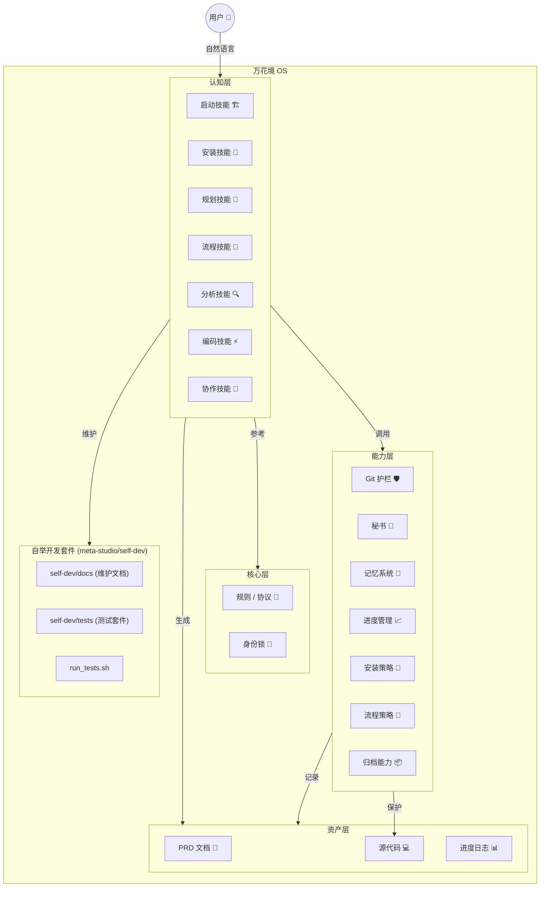
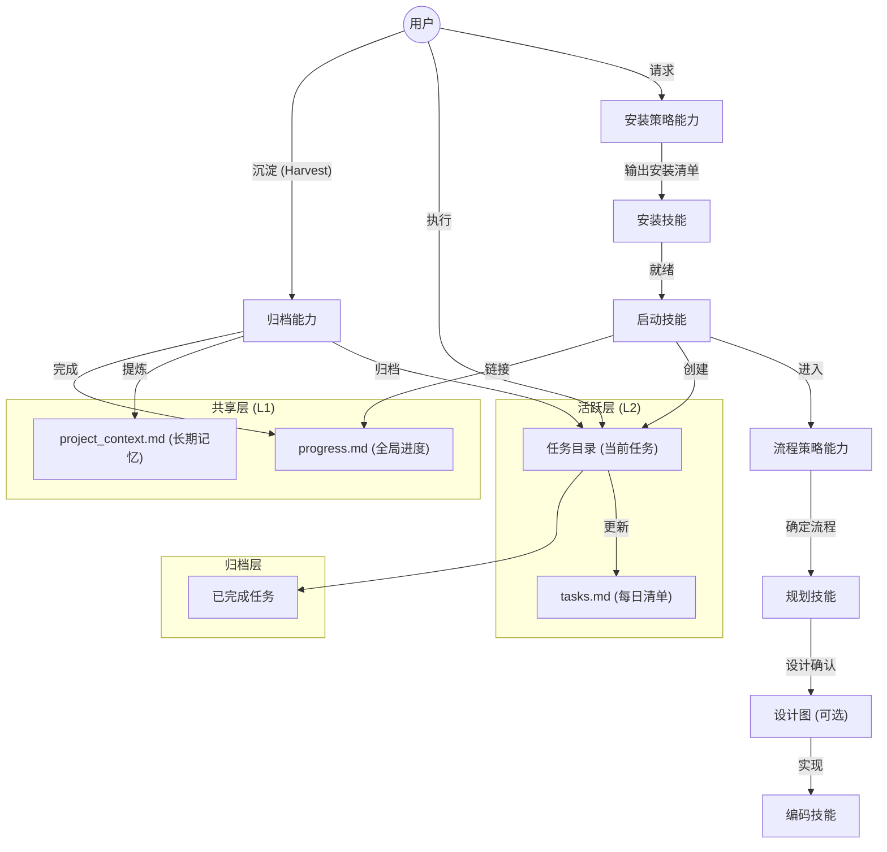
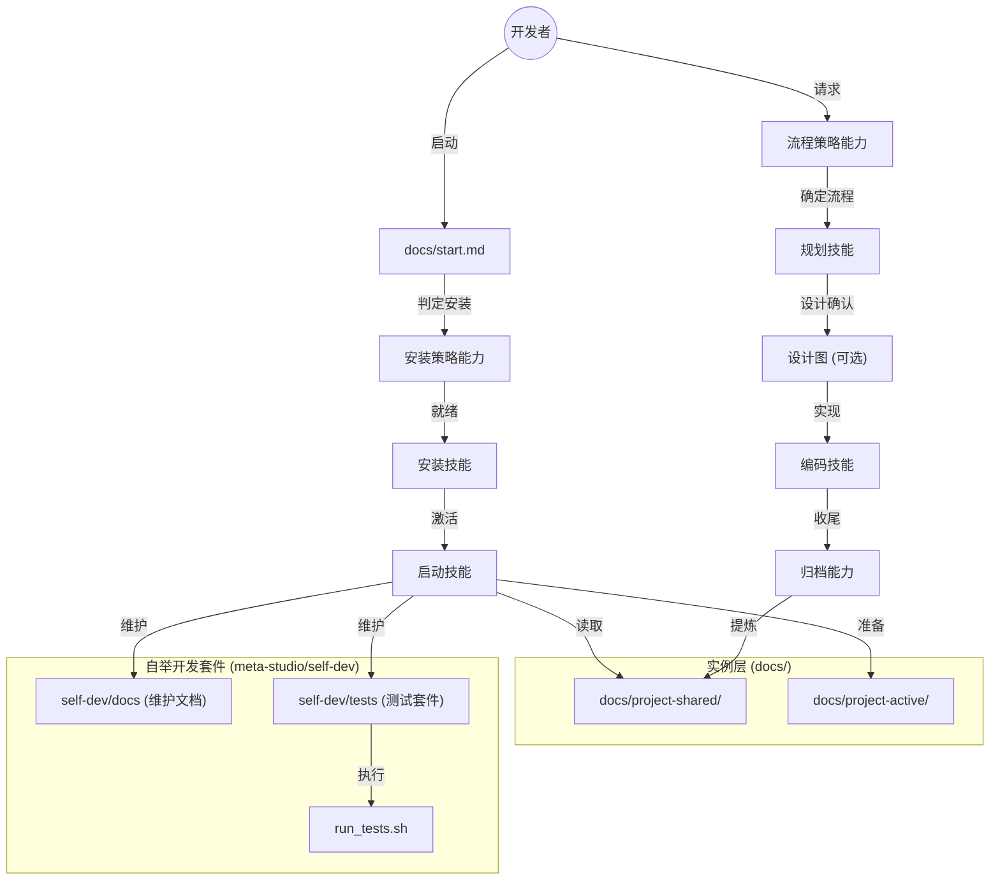

# 🏛️ 架构设计 (Architecture & Design)

## 系统架构 (System Architecture)

KaleidoSphere 采用分层架构设计，确保系统的稳定性与可扩展性。
能力是全局护栏/规则层，技能是执行入口；技能执行时必须遵循能力，能力不调用技能。

## 用户项目工作流 (User Project Workflow)

该流程面向用户项目（嵌入式 `.kaleidosphere`）。KaleidoSphere 引入了 "Active -> 沉淀 -> Shared" 的生命周期管理，实现 **L1 (全局)** 与 **L2 (会话)** 的分级管理。
流程决策由 Workflow Strategy 能力完成，流程执行由 Workflow Skill 驱动。

## 自举开发工作流 (Self-Dev Workflow)

该流程面向万花境自身仓库。入口为 `docs/start.md`，实例层沉淀在 `docs/project-*`，不走 `.kaleidosphere` 更新逻辑。自举开发套件位于 `meta-studio/self-dev`。

